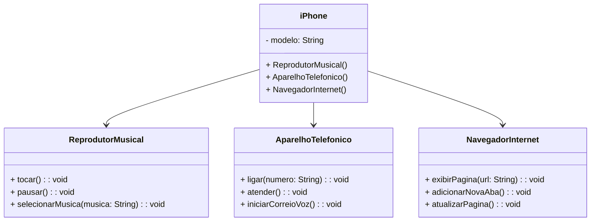

# desafio_UML_dio
modelar e diagramar a representação UML do componente iPhone, abrangendo suas funcionalidades como Reprodutor Musical, Aparelho Telefônico e Navegador na Internet.

## Funcionalidades a Modelar
Reprodutor Musical
Métodos: tocar(), pausar(), selecionarMusica(String musica)
Aparelho Telefônico
Métodos: ligar(String numero), atender(), iniciarCorreioVoz()
Navegador na Internet
Métodos: exibirPagina(String url), adicionarNovaAba(), atualizarPagina()

## Diagrama UML

